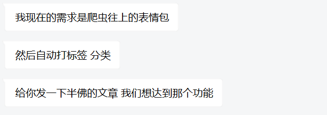
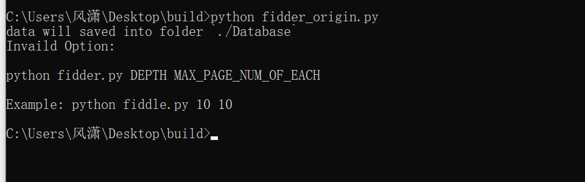
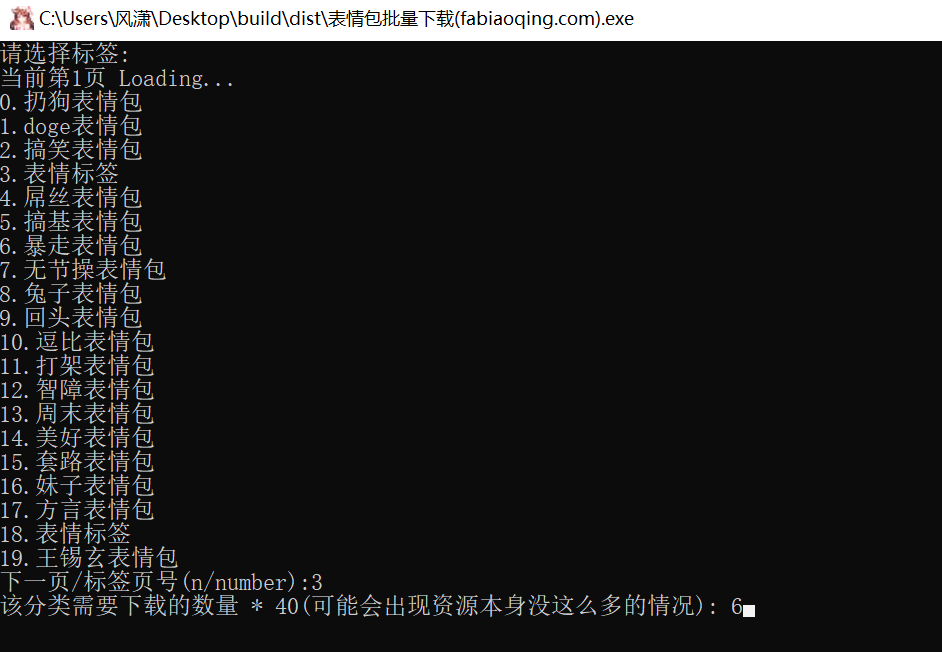
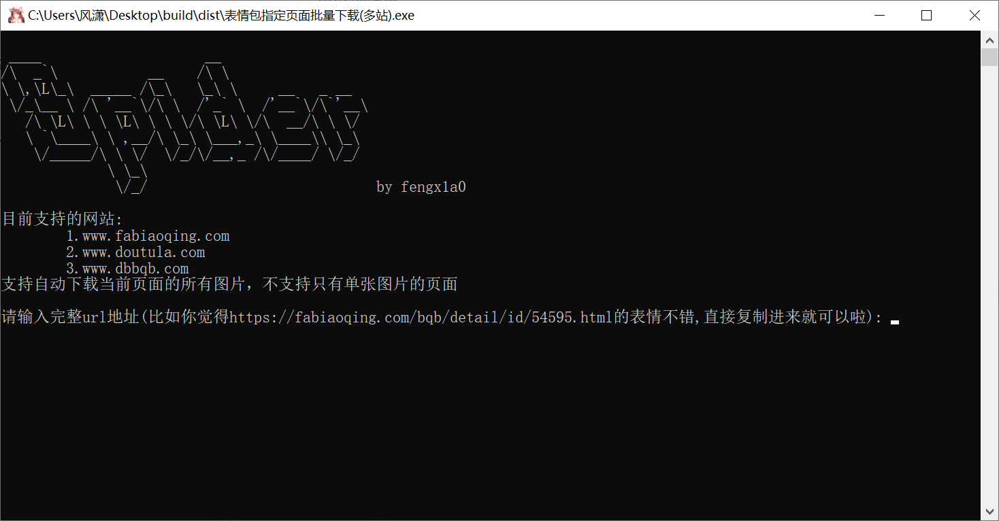

# EmojiSipder

分享个人在做爬虫项目时的一点经历

接到了这样一个需求

[知乎](https://www.zhihu.com/question/384940007/answer/2143770367)

起初我觉得很奇怪，因为从漫天互联网上拉数据根本不现实，看了知乎觉得就是单纯在炫耀自己的DPL训练模型😅

当然，有训练模型最好，但在面对小白客户(连cmd都不知道)的情况下并且需求比较急的情况时，面对海量的互联网数据，我选择去找一些分类好的网站，然后借助api达到客户目标

### Sipder_origin

按照需求写的第一版，以 https://fabiaoqing.com/ 为源，对其标签页进行了批量的爬取以及本地化

### Sipder_fixed

反应说太多太杂，想要的不想要的一并下下来了

我把第一版的批量标签页和标签图片的下载改为了读取所有标签然后提供给客户选择要下载哪个标签页的图片，并可以选择量

可执行二进制文件在

dst/表情包批量下载(fabiaoqing.com).exe

### Enhanced

与其完全的依赖电脑，不如半手工来的效率高，上面无论哪种实现方式，要么一直在下载海量的数据，并且不一定都是想要的内容，要么一页一页依赖自动化程序找分类，光那一个网站就有上万种分类，一次20找显然效率也不怎么高，所以我实现了第三种方法

客户可以自己现在这些网站上搜索或者浏览寻找自己想要的素材，然后如果他觉得某一页素材都不错，需要批量保存的时候再借助我们的工具迅速导入本地，极大化的加快了素材寻找速度，节省视频制作在不必要的地方的耗费时间。

目前实现了3个网站，后续可能会扩充。

可执行二进制文件在

dst/表情包指定页面批量下载(多站).exe

